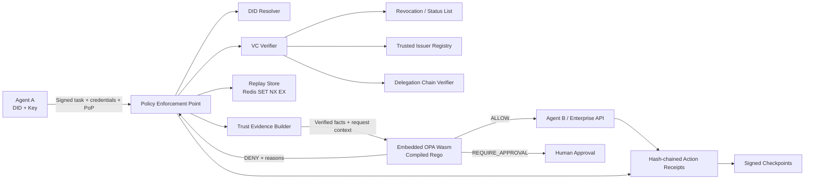

# Agent Trust

**A Trust & Authorization Fabric for AI agents — verifiable identity, scoped delegation, revocable authority, and deterministic policy enforcement.**

> **Trust is not a score. It is verifiable, scoped, revocable authority.**

---

## The Problem

AI agents are increasingly allowed to take real actions — refunds, payments, data access — with nothing but an API key and a prompt. Nobody can answer, before execution, in a way that is cryptographically verifiable:

> *Should this agent be allowed to do this action, for this principal, on this resource, right now — and can we prove why?*

A reputation number cannot answer that question. A high score does not create authority, and a low score does not revoke it. This project replaces the "trust score" with a **trust fabric** that proves each layer independently:

```text
Agent DID
   ↓
Signed proof-of-possession
   ↓
W3C Verifiable Credentials
   ↓
Delegation / Capability chain
   ↓
Credential + Revocation Verification
   ↓
Context + Provenance + Attestations
   ↓
Embedded Rego Policy Engine (OPA Wasm)
   ↓
ALLOW / DENY / REQUIRE_APPROVAL
   ↓
Enterprise Action
   ↓
Tamper-evident Action Receipt
```

## What the Fabric Proves

| Question | Mechanism |
|---|---|
| Who is the agent? | W3C DID (`did:web` in P0, `did:key` for test fixtures), proof-of-possession on every request |
| Who granted its authority? | W3C Verifiable Credentials 2.0 (JWS/ES256) from issuers listed in a **Trusted Issuer Registry** |
| What are the limits? | Scoped actions/resources, amount & time caps, strict **delegation attenuation** (`Authority(child) ⊆ Authority(parent)`) |
| Is it still valid? | W3C Bitstring Status List revocation + emergency quarantine |
| Is *this* action acceptable *now*? | Rego policies compiled to **OPA Wasm, embedded in the service process** — deterministic `ALLOW` / `DENY` / `REQUIRE_APPROVAL` with reason codes |
| What actually happened? | Tamper-evident, hash-chained **Action Receipts** with signed checkpoints |

## The Sentence That Leads This Project

> **Identity tells us who the agent is. Credentials tell us what others claim about it. Delegation tells us what it is allowed to do. Reputation provides evidence about past behavior. Policy decides whether this specific action is acceptable now.**
>
> No layer substitutes for another.

And the invariant that makes the model coherent:

> **Reputation can strengthen or weaken trust, but it can never manufacture missing authority.**
>
> - An agent with 10,000 successful actions and no `refund:create` credential → **DENY**.
> - A brand-new agent with a valid low-risk delegation → can be **ALLOW**.
> - A high-reputation agent whose credential was revoked → **DENY**.

## Security Stance

- **The LLM never decides its own permissions.** An agent runtime may *propose* a tool call, but every request passes through an independent, deterministic enforcement point. Prompt injection cannot alter a Verifiable Credential or a Rego policy.
- **Compromised keys are assumed possible.** No cryptography detects an attacker who holds the *valid* private key — so the design limits the blast radius instead: narrow scopes, amount/day caps, audience binding, short credential & proof lifetimes, human-in-the-loop for high-risk actions, revocation, and an emergency quarantine switch.
- **Fail closed.** Missing/invalid policy bundle, unavailable replay store on a write action, audit-log failure, signature-verifier errors — all deny. There is no permissive fallback anywhere.

## Demo Scenario

Two fictional organizations:

```text
Acme Retail                          PayCo
  CustomerSupportAgent  ──refund──▶  PaymentAgent
```

Acme issues its support agent a delegation credential: `refund:create`, `merchant:acme`, **max 500 SAR**, bounded expiry. PayCo's PaymentAgent has **never seen Acme's agent before** — it knows only trusted issuers and policy. Trust is portable across the organizational boundary.

The failure demo is the point:

```text
1) Valid identity + 120 SAR refund          → ALLOW
2) Same identity + 5,000 SAR refund         → DENY  AUTHORITY_LIMIT_EXCEEDED
3) Spoofed identity / wrong private key     → DENY  IDENTITY_PROOF_INVALID
4) Legit agent, credential revoked          → DENY  CREDENTIAL_REVOKED
5) Replay of captured signed bytes          → DENY  REPLAY_DETECTED
```

> **The agent is trusted — but not for this action.**

## Architecture at a Glance



Full details: [docs/architecture.md](docs/architecture.md) · [threat model](docs/threat-model.md) · [credential model](docs/credential-model.md) · [trust model](docs/trust-model.md)

## Repository Layout

```text
agent-trust/
├── apps/
│   ├── web/                  # Next.js demo & operations UI
│   ├── trust-gateway/        # Fastify + embedded OPA Wasm — the enforcement core
│   ├── credential-service/   # Issuance, revocation, trusted-issuer registry
│   ├── agent-alpha/          # Demo agent A (CustomerSupportAgent)
│   └── agent-beta/           # Demo agent B (PaymentAgent)
├── packages/
│   ├── crypto/               # Signer abstraction (local / KMS)
│   ├── did/                  # Resolver abstraction + did:web, did:key, did:webvh adapters
│   ├── vc/                   # W3C VC issue/verify (JWS, ES256)
│   ├── delegation/           # Attenuation-verified delegation chains
│   ├── trust-profile/        # Evidence-based trust profiles
│   ├── schemas/              # JSON schemas for all contracts
│   ├── policy-engine/        # PolicyEngine abstraction + OPA Wasm adapter
│   ├── sdk/                  # Client SDK for agents
│   └── testkit/              # Fixtures, test DID documents, attack builders
├── policies/                 # Rego — policies are code, versioned & hashed
├── tests/                    # conformance / integration / e2e / attacks / chaos
├── infra/                    # docker / terraform
└── docs/                     # architecture, threat model, ADRs, roadmap
```

## Status & Roadmap

**🚧 Architecture frozen — implementation underway (scaffold stage).**

Delivery architecture (P0) is deliberately narrower than the target architecture; the riskiest components are P1 adapters behind stable interfaces, so the live demo never depends on them.

| Phase | Scope |
|---|---|
| **P0 — frozen** | `did:web` + `did:key` fixtures, real JWS/VC signing & verification, scoped delegation + attenuation, trusted issuers + real revocation, atomic Redis replay protection with fail-closed writes, Rego → embedded OPA Wasm with reason codes, tamper-evident provenance, two demo agents, attack suite, public live demo |
| **P1 — after P0 E2E passes** | `did:webvh` resolver adapter, Cloud KMS/HSM signer, human-in-the-loop approvals, RFC 8693 token-exchange subset, one A2A adapter |
| **P2 — post-competition** | SPIFFE/SPIRE deployment, full MCP/A2A interop, multi-tenant control plane, selective disclosure |

Build order and week-by-week plan: [docs/roadmap.md](docs/roadmap.md).

## Development

Prerequisites (planned): Node 22+, pnpm, Docker, PostgreSQL, Redis, and the Open Policy Agent CLI for compiling `policies/` to Wasm.

> The monorepo toolchain lands with the first service (Phase 1 — see roadmap). Until then this repository carries the frozen architecture, threat model, credential contracts, and ADRs. The project's own rule applies: **no UI before cross-agent E2E works** — a single `pnpm demo:e2e` must print that Agent A was accepted or rejected for the right reasons before any dashboard exists.

## Documentation

- [Architecture](docs/architecture.md) — the planes, verification pipeline, and delivery decisions
- [Threat model](docs/threat-model.md) — attack suite, fail-closed matrix
- [Credential model](docs/credential-model.md) — VC types, delegation attenuation rules
- [Trust model](docs/trust-model.md) — trust profiles, reputation-as-evidence, decision objects
- [Roadmap](docs/roadmap.md) — phases, build order, definition of done
- [ADRs](docs/adr/) — frozen architecture decisions
- [Security policy](SECURITY.md) · [Contributing](CONTRIBUTING.md)

## License

[MIT](LICENSE) © abuzaro21 and contributors
